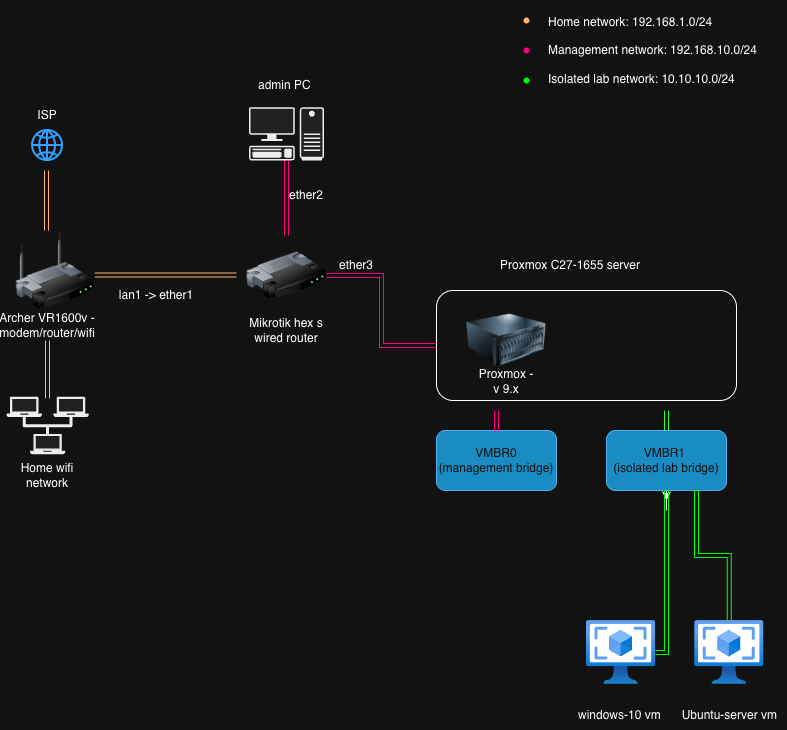

# MichealScott-Homelab

**Building practical IT skills through a hands-on homelab**  
## About This Lab

I'm building a practical, production-like home lab to gain real-world experience and skills to transition into a career in IT. 

The focus is on **hands-on infrastructure** that directly supports my certification path:
- CompTIA A+ → Network+ → Security+
- CCNA
- Microsoft AZ-104 (Azure Administrator)

This repository serves as living documentation of my journey — including hardware upgrades, configurations, network diagrams, troubleshooting notes, and lessons learned.

## Current Lab Status (April 2026)

**Proxmox Host**
- Hardware: Acer C27-1655 (i7-1165G7 + 32GB Kingston ValueRAM)
- Proxmox VE 9.x installed cleanly
- Network bridges created:
  - `vmbr0`: Management bridge (Proxmox GUI at 192.168.1.50)
  - `vmbr1`: Isolated lab bridge 

**First Test VM**
- Ubuntu Server 24.04 LTS (VM ID 101)
- Static IP: 192.168.1.101 on vmbr0
- UEFI (OVMF) BIOS + QEMU Guest Agent running
- Fully updated and internet functional

**Next Milestones**
- Receive MikroTik hEX S router
- Set up isolated lab network behind MikroTik
- Move test VMs to vmbr1 with NAT
- Begin documenting CCNA / Network+ labs

See [progress-log.md](progress-log.md) and [hardware-inventory.md](hardware-inventory.md) for details.

## Repository Structure
- `/projects/` → Detailed project folders by topic/cert
- `/docs/` → Guides and troubleshooting
- `/diagrams/` → Network and architecture visuals
- `/scripts/` → Automation and useful scripts

## Current Lab Network Diagram

*Proxmox VE 9.x on Acer C27-1655 with management bridge `vmbr0` (192.168.1.50) and isolated lab bridge `vmbr1`.  
MikroTik hEX S will be added soon between the Archer and Proxmox for proper routing and isolation.*

## Key Projects
- **[Proxmox Setup](projects/01-proxmox-setup)**: Upgraded Acer AIO to 32GB RAM, clean Proxmox install, isolated bridges
- **[MikroTik Lab](projects/02-mikrotik-lab)**: Router behind Archer AX1600 with separated lab network

## Contact / Connect
- X: @michealscott413

---

*Last updated: April 4 2026*
