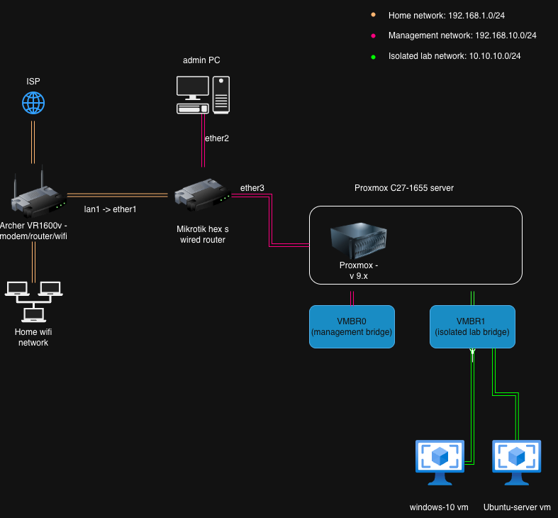

# MichealScott-Homelab

**Building practical IT skills through a hands-on homelab**  
## About This Lab

I'm building a practical, production-like home lab to gain real-world experience and skills to transition into a career in IT. 

## Current Lab Status (May 2026)

**Proxmox Host**
- Hardware: Acer C27-1655 (i7-1165G7 + 32GB RAM + 1TB ssd)
- Proxmox VE 9.x installed cleanly
- Network bridges created:
  - `vmbr0`: Management bridge 
  - `vmbr1`: Isolated lab bridge 

**Installed VM's and containers**
- Ubuntu Server 24.04 LTS 
  - Static IP: 10.10.10.101 on vmbr1
- Windows 10 25H2
  - Static IP: 10.10.10.102 on vmbr1
- Kali Linux

See [progress-log.md](progress-log.md) and [hardware-inventory.md](hardware-inventory.md) for details.

## Repository Structure
- `/projects/` → Detailed project folders by topic/cert
- `/docs/` → Guides and troubleshooting
- `/diagrams/` → Network and architecture visuals
- `/scripts/` → Automation and useful scripts

## Current Lab Network Diagram

*Proxmox VE 9.x on Acer C27-1655 with management bridge `vmbr0` (192.168.10.x) and isolated lab bridge `vmbr1` (10.10.10.x)  

## Key Projects
- **[Proxmox Setup](projects/01-proxmox-setup)**: Upgraded Acer AIO to 32GB RAM, clean Proxmox install, isolated bridges
- **[MikroTik Lab](projects/02-mikrotik-lab)**: Router behind Archer AX1600 with separated lab network

## Contact / Connect
- X: @michealscott413

---

*Last updated: April 4 2026*
